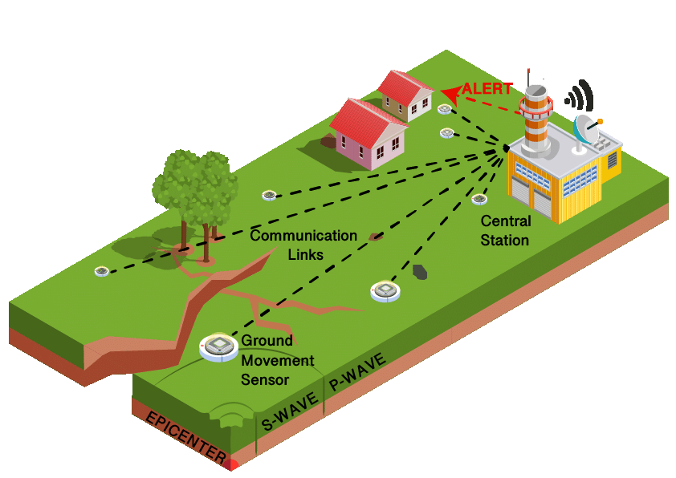

# Earthquake Detection System 🌍🚨

 

## Overview

The Earthquake Detection System is a comprehensive machine learning project designed to detect earthquakes using sensor data from gyroscopes and accelerometers. The system classifies time-series data into "earthquake" or "normal" categories using various machine learning models. This project includes data generation, model training, evaluation, and validation to ensure robust performance.

## Project Components

### 1. Data Generation 🛠️

The system generates synthetic and realistic sensor data to train and test the models. The dataset includes:
- **Accelerometer Data (Ax, Ay, Az)**: Measures acceleration in the X, Y, and Z axes.
- **Gyroscope Data (Gx, Gy, Gz)**: Measures rotational velocity in the X, Y, and Z axes.
- **Labels**: Binary labels where `0` indicates normal conditions and `1` indicates earthquake conditions.

#### Data Generation Details
- **Normal Condition**: Generates steady accelerometer data with low noise and minimal gyroscope data variation.
- **Earthquake Condition**: Introduces spikes and larger variations in both accelerometer and gyroscope data to simulate real earthquake events.

 <!-- Replace with actual URL or path -->

### 2. Model Training 🤖

Several machine learning models are trained and evaluated, including:

#### a. Random Forest 🌳
- **Concept**: An ensemble learning method that constructs multiple decision trees and outputs the mode of the classes or mean prediction of the individual trees.
- **Benefits**: Handles high-dimensional data well, reduces overfitting, and is robust to noisy data.

#### b. XGBoost 🏆
- **Concept**: An optimized gradient boosting library designed to be highly efficient, flexible, and portable.
- **Benefits**: High performance, scalability, and effective for large datasets with complex patterns.

#### c. Support Vector Machine (SVM) 🚀
- **Concept**: Finds the optimal hyperplane that maximizes the margin between different classes. Effective in high-dimensional spaces with different kernel functions.
- **Benefits**: Robust to overfitting and effective for complex datasets.

#### d. Long Short-Term Memory (LSTM) ⏳
- **Concept**: A type of Recurrent Neural Network (RNN) capable of learning long-term dependencies and handling sequences of data.
- **Benefits**: Excellent for sequential data, captures temporal dependencies, and is effective for time-series forecasting.

 <!-- Replace with actual URL or path -->

### 3. Model Evaluation 📊

Models are evaluated using various metrics:
- **Accuracy**: The proportion of correctly classified samples.
- **Precision**: The ratio of true positive samples to all predicted positives.
- **Recall**: The ratio of true positive samples to all actual positives.
- **F1 Score**: The harmonic mean of precision and recall.

### 4. Cross-Validation 🔍

Cross-validation techniques ensure robustness and generalization:
- **K-Fold Cross-Validation**: Splits the data into `k` subsets and trains the model `k` times with different training and validation sets.
- **Stratified K-Fold Cross-Validation**: Maintains class balance in each fold, ensuring representative samples.

### 5. Visualization 📈

The training and validation metrics are visualized to analyze model performance:
- **Training and Validation Accuracy**: Shows accuracy changes over epochs for both training and validation sets.
- **Training and Validation Loss**: Displays loss values over epochs, indicating learning effectiveness.

 <!-- Replace with actual URL or path -->

## Flowchart

 <!-- Replace with actual URL or path -->

## Installation 🛠️

### Prerequisites

- Python 3.6 or higher
- pip (Python package installer)

### Installation Steps

1. **Clone the Repository**

    ```bash
    git clone https://github.com/adityajhakumar/earthquake-detection.git
    cd earthquake-detection
    ```

2. **Install Required Packages**

    Create a virtual environment (recommended) and install the dependencies.

    ```bash
    python -m venv venv
    source venv/bin/activate  # On Windows use `venv\Scripts\activate`
    pip install -r requirements.txt
    ```

3. **Requirements**

    Create a `requirements.txt` file with the following content:

    ```plaintext
    numpy
    pandas
    scikit-learn
    keras
    matplotlib
    ```

## Usage 🚀

### Data Generation

To generate synthetic and realistic sensor data, run the `generate_data.py` script:

```bash
python generate_data.py
```

This will produce a CSV file named `balanced_earthquake_dataset.csv` with the generated data.

### Model Training and Evaluation

To train and evaluate the machine learning models, use the `train_evaluate_models.py` script:

```bash
python train_evaluate_models.py
```

This script will train models, evaluate them, and output performance metrics including accuracy, precision, recall, and F1 score.

### Cross-Validation

For performing cross-validation, the `cross_validation.py` script can be used:

```bash
python cross_validation.py
```

## Evaluation Metrics

- **Accuracy**: Proportion of correctly classified samples.
- **Precision**: Proportion of true positive samples out of all predicted positives.
- **Recall**: Proportion of true positive samples out of all actual positives.
- **F1 Score**: Harmonic mean of precision and recall.

## License 📝

This project is licensed under the Apache License 2.0 - see the [LICENSE](LICENSE) file for details.

## Contact 📧

For any questions or feedback, please contact [Aditya Kumar Jha](mailto:your.email@example.com).

